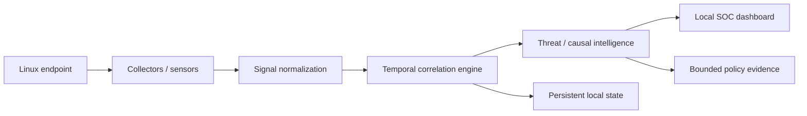

# SYSWATCH PRO

### Endpoint security that understands behavior — not just alerts.

**SYSWATCH** is a local-first Linux endpoint-security platform that observes host behavior, connects security signals into temporal attack chains, and gives the operator a live security picture from a single local console.

> **Observe → Correlate → Understand → Respond**

No cloud account is required for the local dashboard. The project is deliberately transparent about what is implemented, what is tested, and what remains under development.

---

## The product

SYSWATCH is designed around a simple question:

> **What is happening on this machine right now, and does the activity make sense as a whole?**

Instead of presenting every event as an isolated alert, SYSWATCH combines host telemetry, normalized security signals and temporal correlation so that an operator can move from **machine state → security posture → suspicious behavior → causal chain → evidence**.

### What you see after installation

```text
┌───────────────────────────────────────────────────────────────────┐
│ SYSWATCH PRO                         ● AGENT ONLINE      14:32:08 │
│ ENDPOINT SECURITY                                                  │
├───────────────────────────────────────────────────────────────────┤
│ ENDPOINT                         SECURITY POSTURE                  │
│ srv-prod-01                     87 / 100                          │
│ Ubuntu · Linux · kernel ...     Firewall       ACTIVE             │
│ Uptime 17d · Load 0.42          Wi-Fi          WPA3               │
│ Interfaces 3 · Listening 8      SSH            OK                 │
├────────────┬────────────┬────────────┬────────────────────────────┤
│ CPU        │ MEMORY     │ DISK       │ THREAT INTELLIGENCE        │
│ 23%        │ 61%        │ 48%        │ LOW · score 0              │
│ live graph │ live graph │ live graph │ causal engine              │
├────────────┴────────────┴────────────┴────────────────────────────┤
│ RESOURCE TELEMETRY · LAST 60 SAMPLES                              │
│     ╭──╮                                                         │
│ ────╯  ╰────╮──────╭────────────────────────                    │
├──────────────────────────────┬────────────────────────────────────┤
│ NETWORK SECURITY             │ ACTIVE CAUSAL ATTACK CHAINS       │
│ wlan0 · WPA3 · -48 dBm       │ SSH → shell → persistence         │
│ eth0  · up                   │ port → process → C2               │
├──────────────────────────────┴────────────────────────────────────┤
│ LIVE SECURITY EVENT STREAM                                       │
│ 14:31:55 [LOW]  NETWORK — connection observed                    │
│ 14:31:42 [LOW]  PROCESS — process started                        │
└───────────────────────────────────────────────────────────────────┘
```

The values above are **illustrative UI examples**, not measured SYSWATCH output.

---

## Why SYSWATCH?

| Conventional host monitoring | SYSWATCH direction |
|---|---|
| Raw machine metrics | Host + security context |
| Individual alerts | Temporal signal correlation |
| Process list | Process intelligence and lineage |
| Open-port list | Network + process attribution |
| Static checks | Continuous telemetry |
| Alert severity | Threat score + causal evidence |
| Cloud-first console | Local-first operation |

The differentiating layer is the attempt to connect **weak signals into coherent behavioral stories** instead of simply increasing the number of alerts.

---

## Live security console

The current dashboard is built as a local browser application and refreshes host telemetry continuously.

### Endpoint identity

- Hostname
- Operating system / kernel
- Uptime
- Load averages
- Network interfaces
- Listening endpoints
- Agent status

### Resource intelligence

- CPU utilization
- Memory utilization
- Disk utilization and free space
- Live session graphs
- Load trend
- Process count
- Bounded local resource prediction

### Security posture

Where supported by the host, SYSWATCH surfaces:

- Firewall backend and state
- Wi-Fi interface, SSID, security mode and signal information
- SSH configuration posture
- Active causal chains
- Security-event history
- Policy evidence derived from existing normalized security/network signals

The dashboard distinguishes unavailable telemetry from healthy telemetry rather than silently inventing a value.

### Network view

- Interface state
- Wired / wireless classification
- RX/TX byte counters
- Wi-Fi security information when available
- Listening TCP/UDP endpoints
- Local network state
- DNS/network intelligence where supported

### Security timeline

The event stream provides a continuously updated view of normalized security events and their severity, while the causal engine groups related events into chains. The policy-evidence layer is read-only and does not execute containment or other host-mutating actions.

---

## Causal attack intelligence

The central detection concept is **causal correlation**.

```text
              ┌───────────────┐
              │  INITIAL      │
              │  ACCESS       │
              └───────┬───────┘
                      │
                      ▼
              ┌───────────────┐
              │ PROCESS /     │
              │ SHELL EVENT   │
              └───────┬───────┘
                      │
                      ▼
              ┌───────────────┐
              │ PERSISTENCE / │
              │ PRIVESC        │
              └───────┬───────┘
                      │
                      ▼
              ┌───────────────┐
              │ NETWORK / C2  │
              └───────┬───────┘
                      │
                      ▼
              ⚠ CAUSAL CHAIN
```

A single signal can be noisy. A sequence of related signals can be evidence.

SYSWATCH therefore maintains a temporal window, normalizes security events, evaluates known signal combinations and exposes the resulting chain with confidence and context.

This is intentionally deterministic in the current implementation. It is not marketed as an opaque AI detector.

---

## Architecture



### Telemetry pipeline

```text
Linux host
   │
   ├── Host sensors
   │     ├── CPU / memory / disk
   │     ├── process state
   │     ├── uptime / load
   │     └── network interfaces
   │
   ├── Security sensors
   │     ├── listening endpoints
   │     ├── firewall state
   │     ├── Wi-Fi security
   │     ├── SSH posture
   │     └── existing security modules
   │
   ▼
Signal normalization
   │
   ├── NEW-PORT
   ├── REVERSE-SHELL
   ├── FILE-INTEG
   ├── CRON-PERSIST
   ├── C2-CONNECT
   ├── HONEYPOT
   └── PRIVESC
   │
   ▼
Causal correlation
   │
   ├── temporal window
   ├── multi-signal chains
   ├── confidence scoring
   └── persistent event state
   │
   ▼
Evidence / policy layer
   │
   ├── bounded local evaluation
   ├── normalized confidence
   ├── read-only API
   └── no autonomous response
   │
   ▼
Local SOC
   ├── endpoint identity
   ├── security posture
   ├── resource graphs
   ├── network state
   ├── attack chains
   └── live event stream
```

---

## Install in minutes

### Requirements

A Linux machine with:

- `git`
- `python3`
- `systemd`
- root / sudo access

Optional host tools such as `ss`, `ufw`, `firewall-cmd`, `nft`, `iw`, and `nmcli` provide richer telemetry when available.

### Install

```bash
git clone https://github.com/BurhanAbdullah/Syswatch.git
cd Syswatch
sudo ./install.sh
```

The installer places SYSWATCH under `/opt/syswatch`, creates the `syswatch` command, installs a systemd service, enables it at boot, and starts it.

Open:

```text
http://127.0.0.1:8080
```

or:

```bash
syswatch open
```

### Verify

```bash
syswatch status
syswatch logs
curl -fsS http://127.0.0.1:8080/api/health
```

---

## First-run experience

Once the service is running, the dashboard begins collecting local host telemetry automatically.

The recommended workflow is:

```text
1. Install
      ↓
2. Open local console
      ↓
3. Confirm endpoint identity
      ↓
4. Review security posture
      ↓
5. Watch live resource / network telemetry
      ↓
6. Review bounded predictions when sufficient history exists
      ↓
7. Inspect policy evidence
      ↓
8. Feed or collect security signals
      ↓
9. Inspect causal chains and event evidence
```

No destructive response is triggered simply because an alert appears.

---

## Live graphs

SYSWATCH treats visualization as part of the security interface rather than decoration.

The dashboard maintains session history for:

- CPU
- Memory
- Disk utilization
- System load

The visualization layer also exposes bounded prediction output when sufficient local history is available. Predictions are informational and do not constitute a security verdict or autonomous action.

Future analytics should be populated from real host telemetry, not placeholder values.

---

## Feed security events

Existing security modules can send normalized signals through the bridge:

```bash
syswatch-signal NEW-PORT "Port 2222 opened"
syswatch-signal REVERSE-SHELL "unexpected shell process"
syswatch-signal FILE-INTEG "/tmp/.implant written"
syswatch-signal CRON-PERSIST "new scheduled task"
syswatch-signal C2-CONNECT "unexpected outbound endpoint"
syswatch-signal HONEYPOT "credential backup accessed"
syswatch-signal PRIVESC "new SUID executable"
```

---

## Safe built-in demonstration

SYSWATCH includes a synthetic demonstration that injects telemetry only; it does **not** attack the host.

```bash
cd /opt/syswatch
bash syswatch/agents/feed_signal.sh --demo
```

Refresh the dashboard and inspect the resulting causal activity.

For development checkouts:

```bash
bash syswatch/agents/feed_signal.sh --demo
python3 -m pytest -q
```

---

## Adversarial validation

The repository contains safe synthetic tests covering:

- reverse-shell establishment;
- persistence after initial access;
- privilege-escalation indicators;
- credential-access indicators;
- ransomware-like mass-write + C2 correlation;
- cryptominer-like C2 + abnormal CPU correlation;
- SSH brute-force precursor patterns;
- signal-order variation;
- noisy benign telemetry;
- correlation-window expiry;
- state persistence after restart;
- multi-stage attacks producing multiple simultaneous chains;
- bounded prediction input and history limits;
- policy evidence confidence handling;
- read-only policy API boundaries.

No exploit or destructive payload is executed by these tests.

These tests validate controlled telemetry patterns; they are not evidence of universal real-world malware detection accuracy.

---

## Security boundary

SYSWATCH is deliberately conservative about its claims.

- It does **not** claim 99.99% detection accuracy.
- Current causal detection is deterministic and based on normalized signals within a temporal window.
- Slow-and-low activity separated beyond the current correlation window is a known detection gap.
- Automated destructive response is not enabled by default.
- The current policy-evidence API is read-only and does not perform containment, command execution, or host mutation.
- Future containment should be policy-driven, least-privilege, auditable and reversible where practical.
- The dashboard binds to localhost by default.
- Do not expose the dashboard publicly without authentication and an explicit network-security design.

---

## Product roadmap

```text
CURRENT — implemented and validated in the repository
  ✓ Local SOC dashboard
  ✓ Host telemetry
  ✓ Network endpoints
  ✓ Firewall / Wi-Fi / SSH posture where available
  ✓ Temporal causal correlation
  ✓ Persistent local state
  ✓ Linux service integration
  ✓ Synthetic adversarial validation
  ✓ Behavioral baseline / host DNA
  ✓ Process parent-child lineage
  ✓ DNS / network intelligence
  ✓ Filesystem behavioral monitoring
  ✓ Bounded local prediction engine
  ✓ Prediction dashboard integration
  ✓ Bounded evidence policy engine
  ✓ Read-only policy evidence API

NEXT — dependency-ordered engineering work
  □ Safe reversible containment
  □ Sensor health / tamper resistance
  □ Signed updates / supply-chain hardening
  □ Debian / Ubuntu / RHEL-family packages
  □ Reproducible release artifacts and release process
  □ Cross-platform agents
  □ Independent security evaluation
  □ False-positive / detection benchmarking

SECURITY GATE
  Every feature must preserve least privilege, secure defaults, local-first data boundaries,
  bounded resource use, input validation, deterministic regression/adversarial tests, and
  green CI before promotion. SYSWATCH must not claim production EDR status until the
  remaining controls and independent evaluation are complete.
```

---

## Design principles

**Local-first.** The local machine should remain useful even without a cloud account.

**Evidence over hype.** Implemented behavior, test coverage and future work are clearly separated.

**Context over alert volume.** A coherent chain is more useful than a pile of unrelated warnings.

**Safe by default.** Monitoring should not silently become destructive response.

**Inspectable.** The system should be understandable by the operator and auditable by developers.

**Product, not script.** Installation, service lifecycle, dashboard, telemetry, validation and documentation are treated as one system.

---

## Development

Run the API directly:

```bash
python3 syswatch/api/server.py
```

Run all tests:

```bash
python3 -m pytest -q
```

The API is intentionally localhost-bound by default and uses request-trust checks and security headers for the local dashboard boundary.

---

## Uninstall

```bash
sudo /opt/syswatch/uninstall.sh
```

or:

```bash
sudo syswatch uninstall
```

---

## Project status

SYSWATCH is under active development toward a production endpoint-security platform. The repository intentionally distinguishes **implemented capabilities**, **validated behavior**, **known limitations**, and **future product milestones**.

## License

See [`LICENSE`](LICENSE).
